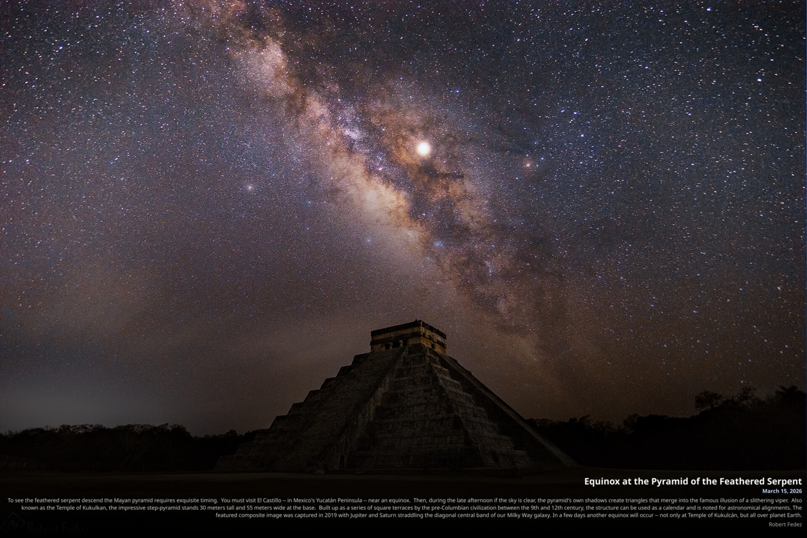

# APOD Wallpaper Overlay

<p align="center">
  
</p>

A standalone automated tool designed for **Linux** systems using the **GNOME Desktop Environment**. It automatically downloads the [NASA Astronomy Picture of the Day (APOD)](https://apod.nasa.gov/), generates high-quality information overlays, and updates the desktop background.

## Overview

The application performs the following automated tasks:
1. Retrieves metadata and high-resolution imagery from the NASA APOD API.
2. Generates an aesthetic information overlay including the title, date, explanation, and copyright information.
3. Automatically detects screen resolution and Desktop Environment scaling parameters (e.g., 'zoom', 'scaled') to ensure precise text positioning.
4. Manages local storage by performing periodic cleanup of the image repository to maintain a specified disk quota.

## Installation

To initialize the application and its dependencies, first clone the repository and navigate into the project directory:

```bash
git clone https://github.com/thibaultmerle/apod.git
cd apod
```

Then, execute the provided setup script:

```bash
chmod +x setup.sh
./setup.sh
```

This script will verify python dependencies, configure executable permissions, and register a systemd user timer to automate updates every 4 hours.

## Requirements

*   System: Linux with GNOME Desktop Environment
*   Runtime: Python 3.6 or higher
*   Dependencies: `Pillow`, `requests` (automated by setup script)
*   Rendering Engine: `ImageMagick` (required for Pango-based typography)

## Manual Execution and Testing

The script supports manual execution for immediate updates or for retrieving specific historical dates (format: `YYYYMMDD` or `YYYY-MM-DD`).

> [!NOTE]
> The very first APOD ever published was on **June 16, 1995** (`19950616` — *Neutron Star Earth*). The NASA APOD archive begins on this date; earlier dates are not available.

```bash
# Update to the current day's APOD
python3 ./apod_wallpaper_overlay.py

# Retrieve a specific date (Format: YYYYMMDD)
python3 ./apod_wallpaper_overlay.py 20240101

# Retrieve the very first APOD published by NASA (June 16, 1995)
python3 ./apod_wallpaper_overlay.py 19950616
```

## System Integration

The application integrates with `systemd` to provide persistent background updates.

```bash
# Verify scheduled update times
systemctl --user list-timers --all | grep apod

# Monitor application logs
journalctl --user -u apod-wallpaper-overlay.service -f
```

## Configuration

Customization of the rendered overlay can be achieved by modifying the configuration constants within `apod_wallpaper_overlay.py`.

| Parameter | Description | Default |
|-----------|-------------|---------|
| `SCREEN_TITLE_SIZE` | Font size for the primary title in screen pixels | 24 |
| `SCREEN_DATE_SIZE` | Font size for metadata and copyright in screen pixels | 14 |
| `SCREEN_EXPLANATION_SIZE` | Font size for the description text in screen pixels | 13 |
| `SCREEN_MARGIN` | Horizontal margin from screen edge in pixels | 25 |
| `SCREEN_BOTTOM_COPYRIGHT` | Bottom margin from display edge in pixels | 35 |
| `MAX_STORAGE_MB` | Maximum disk quota for the image repository in MB | 256 |
| `UPDATE_FREQUENCY_HOURS` | Targeted frequency for background updates | 4 |

### API Authentication
The application defaults to NASA's shared `DEMO_KEY`, which has strict hourly rate limits. For reliable use, register for a free API key at [api.nasa.gov](https://api.nasa.gov/) (instant, no credit card required) and provide it via any of the following methods:

- **Environment Variable**: `export NASA_API_KEY="your_api_key_here"` (or add to `~/.bashrc` / systemd environment)
- **Config file**: Save your key in `~/.config/apod/api_key` or `~/dev/apod/api_key.txt`
- **Code**: Edit `NASA_API_KEY` in `apod_wallpaper_overlay.py`

## Directory Structure

*   `apod_wallpaper_overlay.py`: Primary execution logic and image processing.
*   `open_apod.py`: Helper utility to launch the NASA documentation for the current image.
*   `pic/`: Local repository for source images and generated composites.
*   `setup.sh`: Automated installation and configuration utility.
*   `apod-wallpaper-overlay.*`: Systemd timer and service configurations.

## Technical Implementation

The application's execution pipeline is designed for reliability and visual precision:

1.  **Automation Cycle**: Background execution is managed via `systemd` user timers, checking for updates periodically (defined by `UPDATE_FREQUENCY_HOURS`) to ensure the desktop background syncs with the latest NASA release.
2.  **Data Acquisition**: The script performs automated requests to the NASA APOD API to retrieve high-definition image assets and corresponding narrative metadata.
3.  **Adaptive Screen-Resolution Compositing**: 
    * The system queries the active display resolution via `xrandr` (e.g., 2560x1440) and GNOME scaling mode (`scaled`, `zoom`, `centered`, etc.).
    * A native screen-sized canvas is generated, and the source APOD image is fitted onto this canvas using high-quality Lanczos resampling.
4.  **Decoupled Typography Pipeline**: Overlays are rendered directly at native screen resolution using the ImageMagick Pango engine with subpixel anti-aliasing. Text quality and legibility are completely independent of source picture resolution or aspect ratio.
5.  **Smart Side-Bar Layout & Contrast**: When pillarbox side bars exist (e.g. square or portrait images in `scaled` mode), the text neatly populates the side bar without obscuring the astronomical subject. For full-width images, an anti-contrast gradient plate guarantees effortless readability over bright celestial bodies.
6.  **Missing Image Fallback**: If NASA has no picture for a requested day (e.g. text/video days, service outages, or dates outside available bounds), the script searches for and automatically selects the closest available day with a picture, explicitly notifying the user and noting the adjustment on the wallpaper.
7.  **Storage Maintenance**: An automated routine enforces the disk quota specified in `MAX_STORAGE_MB` within the `pic/` directory, identifying and purging the least recently modified assets to optimize storage utilization.

## Credits

Developed and refined by **Thibault Merle** in collaboration with **Antigravity** (Google DeepMind's AI Coding Assistant).
